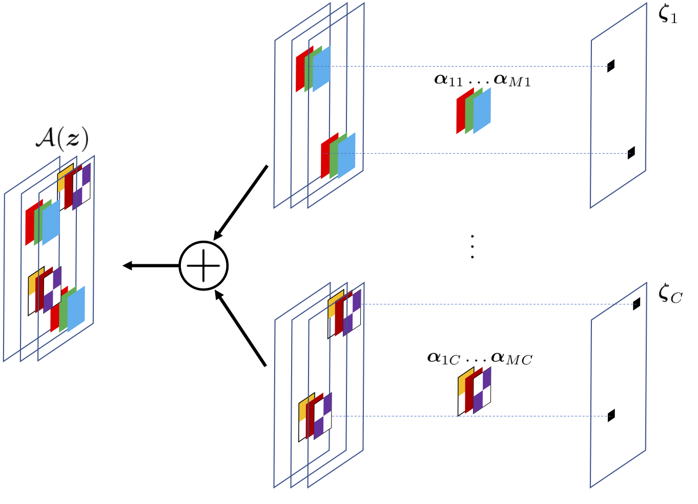
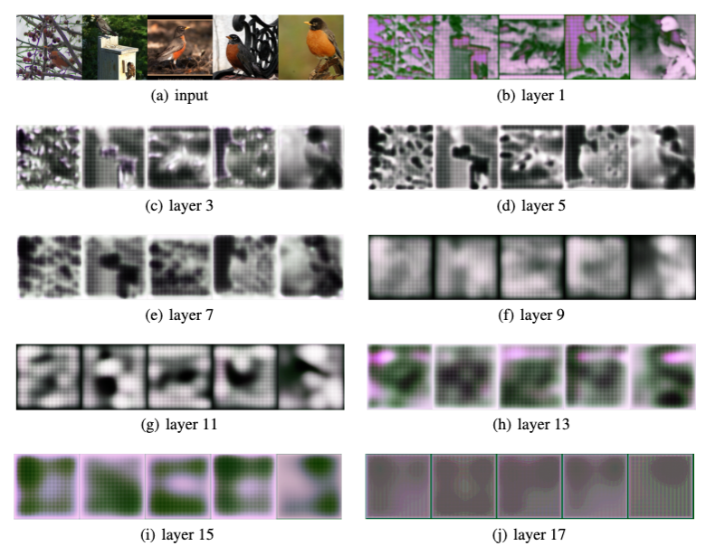

# SDNet — Revisiting Sparse Convolutional Model for Visual Recognition

This repository contains the official PyTorch implementation of the paper: 
[Xili Dai*](https://delay-xili.github.io/), [Mingyang Li*](https://thulimy.github.io/), 
[Pengyuan Zhai](https://billyzz.github.io/), [Shengbang Tong](https://tsb0601.github.io/petertongsb/),
[Xingjian Gao](https://xgao0613.github.io/), [Shao-Lun Huang](https://sites.google.com/view/slhuang/), [Zhihui Zhu](https://www.cis.jhu.edu/~zhihui/index.html), 
[Chong You](https://sites.google.com/view/cyou), [Yi Ma](https://people.eecs.berkeley.edu/~yima/). 
["Revisiting Sparse Convolutional Model for Visual Recognition"](https://arxiv.org/abs/2210.12945). NeurIPS 2022.

## Introduction
Despite strong empirical performance for image classification, 
deep neural networks are often regarded as ``black boxes'' and they are difficult to interpret. 
On the other hand, sparse convolutional models, which assume that a signal can be expressed by a linear combination of a few elements from a convolutional dictionary, 
are powerful tools for analyzing natural images with good theoretical interpretability and biological plausibility. 
However, such principled models have not demonstrated competitive performance when compared with empirically designed deep networks. 
This paper revisits the sparse convolutional modeling for image classification and bridges the gap between good empirical performance (of deep learning) and good interpretability (of sparse convolutional models). 
Our method uses differentiable optimization layers that are defined from convolutional sparse coding as drop-in replacements of standard convolutional layers in conventional deep neural networks. 
We show that such models have equally strong empirical performance on CIFAR-10, CIFAR-100 and ImageNet datasets when compared to conventional neural networks. 
By leveraging stable recovery property of sparse modeling, we further show that such models can be much more robust to input corruptions as well as adversarial perturbations in testing through a simple proper trade-off between sparse regularization and data reconstruction terms.

<p align="center">

</p>

## Reproducing Results

### Installation for Reproducibility

For ease of reproducibility, we suggest you install `Miniconda` (or `Anaconda` if you prefer) before executing the following commands.

```bash
git clone https://github.com/Delay-Xili/SDNet
cd SDNet
conda create -y -n sdnet
source activate sdnet
conda install pytorch torchvision torchaudio cudatoolkit=10.2 -c pytorch
mkdir data logs
```


### Training

To retrain the neural network from scratch on your own machine, execute the following commands 

#### SDNet (CIFAR-10 & CIFAR-100 & ImageNet)

```bash
CUDA_VISIBLE_DEVICES=0 python train.py --cfg experiments/cifar10.yaml --dir_phase cifar10_sdnet18 LOG_DIR path/to/your/current/project
CUDA_VISIBLE_DEVICES=0 python train.py --cfg experiments/cifar100.yaml --dir_phase cifar100_sdnet18 LOG_DIR path/to/your/current/project
CUDA_VISIBLE_DEVICES=0 python train.py --cfg experiments/ImageNet.yaml --dir_phase imagenet_sdnet18 LOG_DIR path/to/your/current/project
```

Some hyper-parameters can be changed directly in the corresponding `xxx.yaml` file. 
We run the experiments on an NVIDIA RTX 3090 with 24GB memory. 
Adjust the ```CUDA_VISIBLE_DEVICES``` parameter based on available GPUs.

Note: this codebase support multi GPUs training, but it is not stable for that. If you want do that, be careful with the hyper-parameters and do grid-search again.

#### SDNet-all (CIFAR-10 & CIFAR-100 & ImageNet)

```bash
CUDA_VISIBLE_DEVICES=0 python train.py --cfg experiments/cifar10.yaml --dir_phase cifar10_sdnet18_all LOG_DIR path/to/your/current/project MODEL.NAME sdnet18_all
CUDA_VISIBLE_DEVICES=0 python train.py --cfg experiments/cifar100.yaml --dir_phase cifar100_sdnet18_all LOG_DIR path/to/your/current/project MODEL.NAME sdnet18_all
CUDA_VISIBLE_DEVICES=0 python train.py --cfg experiments/ImageNet.yaml --dir_phase imagenet_sdnet18_all LOG_DIR path/to/your/current/project MODEL.NAME sdnet18_all TRAIN.BATCH_SIZE 256
```

The trained SDNet-all models could be used to visualize the hidden features. (refer to the commend in section Visualizing the hidden features)
Note: we still have a version SDNet-18-all no short-cut version, you could re-train it based on commend of SDNet-all add ```MODEL.SHORTCUT False```.

### Pre-trained Models

You can download our trained models from the following links:

| Datasets    | Models      | shortcut    | Accuracy    | Results     |
| :---------: | :---------: | :---------: | :---------: | :---------: |
| CIFAR-10    | SDNet-18    |   yes       |  95.34 %    | [link](https://drive.google.com/drive/folders/1oZELeYgrNicKMtuO6RcZgafJMieixawy?usp=sharing)    |
|             | SDNet-18-all|   yes       |  95.02 %    | [link](https://drive.google.com/drive/folders/184YiNng89l2S1g-DPQD_gp8jb3vaTCLw?usp=sharing)    |
|             | SDNet-18-all|   no        |  94.89 %    | [link](https://drive.google.com/drive/folders/1SaVLqGJak-EmaTGwU14juvwIBJn9baFJ?usp=sharing)    |
| CIFAR-100   | SDNet-18    |   yes       |  78.45 %    | [link](https://drive.google.com/drive/folders/1EMA-f-6PsxAvaObp1zXuivl-EDFW4MPc?usp=sharing)    |
|             | SDNet-18-all|   yes       |  77.89 %    | [link](https://drive.google.com/drive/folders/1XYtv8Oh4wgHhP_UAF2P0AZHG0fH6AQEc?usp=sharing)    |
|             | SDNet-18-all|   no        |  77.28 %    | [link](https://drive.google.com/drive/folders/1Jx871n7JAFVCkly8JRCBqKeQAnCNI-rH?usp=sharing)    |
| ImageNet-1k | SDNet-18    |   yes       |  69.78 %    | [link](https://drive.google.com/drive/folders/1USIY9H3Aa4EV0K0T71gCe2VDSbyBIVO0?usp=sharing)    |
|             | SDNet-18-all|   yes       |             | [TBD]()    |
|             | SDNet-18-all|   no        |  69.03 %    | [link](https://drive.google.com/drive/folders/1uKl1QrZyR4M0tNu7d0EF8awQtg2kMLa-?usp=sharing)    |

Each link includes the corresponding results, which consists of checkpoints files, training log files, and tensorboard file. <br>

### Robustness Testing on CIFAR-10-C

```bash
CUDA_VISIBLE_DEVICES=0 python robust_inference.py --cfg experiments/cifar10.yaml --dir_phase cifar10_sdnet18 LOG_DIR path/to/your/current/project TRAIN.MODEL_FILE path/to/the/ckpt/model_best.pth.tar
```
The robust inference results of cifar-10 could be found in the Results link of the first row of the table above.

### Visualizing the hidden features

```bash
CUDA_VISIBLE_DEVICES=0 python visualize.py --cfg experiments/cifar10.yaml --dir_phase cifar10_sdnet18_all_no_shortcut/viz MODEL.NAME sdnet18_all MODEL.SHORTCUT False TRAIN.MODEL_FILE logs/cifar10_sdnet18_all_no_shortcut/model_best.pth.tar
```

You can also directly download the visualization results of the hidden features from the Results link of the third row of the table above. 

<p align="center">

</p>

### Sparse Coding layer for 1D Case

We also offer a version of 1D case for applications like voice or language.

```bash
cd Lib/models
python msc_layer.py
```


## Citation

If you find SDNet useful in your research, please consider citing:

```
@article{dai2022revisiting,
  title={Revisiting Sparse Convolutional Model for Visual Recognition},
  author={Dai, Xili and Li, Mingyang and Zhai, Pengyuan and Tong, Shengbang and Gao, Xingjian and Huang, Shao-Lun and Zhu, Zhihui and You, Chong and Ma, Yi},
  journal={arXiv preprint arXiv:2210.12945},
  year={2022}
}
```

## License

See [LICENSE](LICENSE) for details.